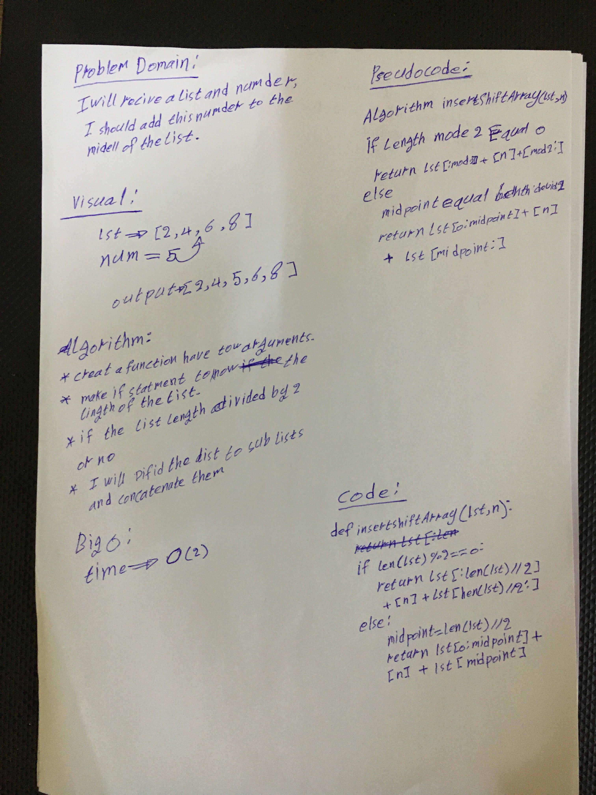

# Array Shift

* Write a function called insertShiftArray which takes in an array and the value to be added. Without utilizing any of the  built-in methods available to your language, return an array with the new value added at the middle index.

## Challenge

* Find best Algorithm to use in reversing the array

## Approach & Efficiency

* I Used the simplist way to solve the problem.

**The Big O for this Algorithm**

* For performance: O(2) 

## Solution

