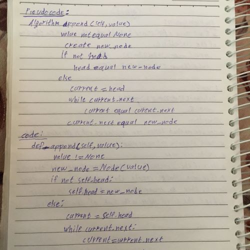

#  Singly Linked List

* Create a Singly Linked List using python OOP

## Challenge

* Create class Node and LinkedList class, use class node to add nodes to the linkedList and create the appropriate methods.

## Approach & Efficiency
<!-- What approach did you take? Why? What is the Big O space/time for this approach? -->
* I Used python OOP.

* Big O: O(1)

### Append Method

* method to add the value to the end of the linkedlist

* **Solution**:

### Insert Before Method

* Method to add a new node with the given newValue immediately before the first value node 

* **Solution**:

### Insert After Method

* Method to add a new node with the given newValue immediately after the first value node

* **Solution**:

## Note:

* I used pytest and pytest-watch to test my code